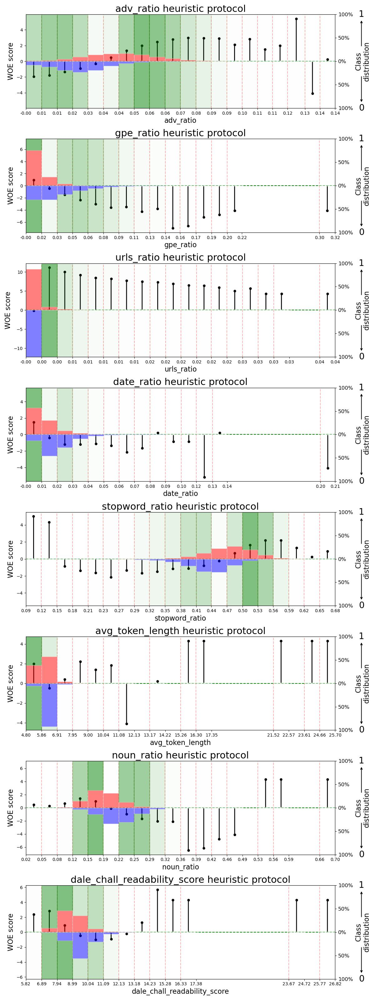

# **Fake News detection**

## **The project**

The aim of this project is to successfully train, test, and select both a machine learning and a deep learning model capable of determining whether a news article is true or fake based on its main body text and title.

<div style="display: flex; align-items: center;">   
   
<p style="max-width: 400px;">     
<strong>News timeline</strong></p> </div>

## **What is to be done?**

The first step is to thoroughly understand the dataset by conducting an extensive Exploratory Data Analysis (EDA). This will provide valuable insights into the data's structure, characteristics, and potential challenges. It will also be the right time to identify and potentially remove texts from the dataset if they could hinder the model's training. In this phase, an in-depth investigation will focus on detecting and removing duplicates and filtering out irrelevant news (e.g., articles that are too short or contain long HTML elements).

<div style="display: flex; align-items: center;">   
   
<p style="max-width: 400px;">     
<strong>WordCloud</strong></p> </div>

Once this is done, we will use a weight-of-evidence-based heuristic model to identify redundant elements that might too easily indicate whether a news article is fake or true, potentially preventing our model from generalizing well. Essentially, the heuristic model will help us build a coherent preprocessing pipeline for our future machine learning models.

After completing the EDA, we decided to augment the dataset, as it contained structurally very different news articles—most true news came from professional journals, while most fake news originated from social media. To address this imbalance, we used Ollama and a Mistral model to modify the style of news articles: converting fake news to appear more professional and true news to resemble social media posts.

<div style="display: flex; align-items: center;">   
   
<p style="max-width: 400px;">     
<strong>Duplicates</strong></p> </div>

Next, we trained, tested, and selected both a machine learning and a deep learning model. We considered two key factors in our selection: detection performance (measured by the F1 score) and training time. While the deep learning model offered better detection performance, it had several drawbacks, including the need for a GPU for fast inference and a long training time.

Finally, we explored model explainability to understand where our models were focusing and what insights this could provide for further improving their performance and generalization.

## **The Data**

Initially, the dataset (available [here](https://drive.google.com/file/d/1CZzfZDvE5E7HaHjk9yeyZDKil4_jkass/view?usp=drive_link)) consisted of two dataframes: one for fake news and one for true news. Through EDA, we realized that these datasets were structurally different, and one of the biggest challenges was reducing these differences as much as possible to help our model generalize better.


## How to run this project

To get started, download the dataset [here](https://drive.google.com/file/d/1CZzfZDvE5E7HaHjk9yeyZDKil4_jkass/view?usp=drive_link) and place it in a directory named `original_data` at the root of your project. Once this is done, you'll need to install all the necessary libraries and dependencies listed in the requirement files. If you're using Conda, you can use the following commands:

```conda create --name <env> --file requirements_conda.txt```

 If you are working in a new virtual environment you will need to set the new kernel

```python3 -m ipykernel install --user --name=kernel_name```

First, you must run the `EDA` notebook located in the `notebooks` directory. This will generate new datasets within the `data` directory that are to later be used by other notebooks.

To avoid long computation times in certain notebooks, such as those involving the fine-tuning of various models, some cells have been skipped using cell magic (`%%skip`). Instead, the machine learning and deep learning models can be loaded from their corresponding directories. These files are too large for GitHub and can be found at https://drive.google.com/drive/folders/1I8InxKDMC_snA-Q2tmJxuZTxMiQopW-8?usp=sharing. To run the project, you will need to download the files and then create a `model_ckpt` directory into which you will transfer the `DistilBERT_256_32_1e-05_0.1.ckpt` file.

## Structure of this project

This project is structured as follows:

- **`/notebooks` directory:** This directory contains the two final notebooks produced during the project. Each notebook can be run independently and in any order.

  - **`EDA.ipynb`** – Performs a comprehensive Exploratory Data Analysis (EDA) of the dataset.
  - **`rewriting.ipynb`** – Demonstrates the news rewriting process. This process is computationally expensive, so we advise against running it and recommend downloading the resulting files instead, as explained earlier.
  - **`machine_learning.ipynb`** – Trains, tests, and selects various machine learning classifiers based on different feature extraction processes.
  - **`deep_learning.ipynb`** – Trains, tests, and selects various deep learning classifiers.

- **`/utilities` directory:** Contains utility files with custom functions frequently used throughout the project.

  - **`stat_utilities.py`** – Includes the `extract_outliers_IQR` function for detecting outliers in the dataset.
  - **`heuristic_utilities.py`** – Defines the `HeuristicModel` class, a weight-of-evidence-based heuristic model. More details on this process can be found in `EDA.ipynb`.
  - **`preprocessing_utilities.py`** – Provides functions for cleaning the original dataset and extracting various features.
  - **`plot_utilities.py`** – Includes utility functions for creating and customizing graphs.
  - **`ml_utilities.py`** – Contains functions to automate and simplify feature extraction and hyperparameter tuning for machine learning classifiers.
  - **`dl_model_utilities.py`** – Defines the deep learning model architectures that were trained and evaluated.
  - **`dl_data_utilities.py`** – Contains functions and classes for handling the data pipeline during model training and testing.
  - **`dl_classifier_utilities.py`** – A flexible framework built around PyTorch Lightning, containing the `TextNewsModule` class, designed for use in future projects.
  - **`dl_callback_utilities.py`** – Defines the `ModelTracker` class, used to track the performance of trained models.

- **`/model_ckpt` directory:** Stores the archive of the best-performing model.

- **`/figs` directory:** Contains the figures embedded in this README file.

- **`requirements_conda.txt`** – Lists all required libraries for running the notebooks in a Conda environment. Install them using:

  ```bash
  conda create --name <env> --file requirements_conda.txt
  ```

- **`model_selection_log.csv`** – A CSV file documenting all tested models, including architecture, training parameters, and relevant validation/test metrics for retrospective comparison.

- **`/logs` directory:** Stores training and evaluation logs for the different models tested.

## **Results**

All deep learning model results are stored in the `/logs` directory and can be visualized by running the following commands in a notebook:

```python
%load_ext tensorboard
%tensorboard --logdir ../logs/model_name
```

Replace `model_name` with the name of one of the subdirectories, each representing a different trained and evaluated model.

### Key Highlights of This Project

- **Implemented** multiple models, both machine learning (ML) and deep learning (DL), experimenting with various classifier architectures, hyperparameters, and scheduling strategies to optimize performance.
- **Evaluated and ranked** models based on classification performance metrics, primarily the F1-score, while also considering training and maintenance requirements. We successfully built both ML and DL models with high F1-scores (0.92 for ML and 0.967 for DL).
- **Conducted a detailed analysis** of model errors and explored potential explanations for misclassifications.
- **Applied LIME** to gain insights into how predictions were made.
- **Discussed potential biases** in these models and their implications.

## **Opportunities for Improvement and Future Directions**

This project also opens several new paths worth exploring:

- **Perform more comprehensive hyperparameter tuning**, as this was only partially done. Bayesian optimization could be used to fine-tune the deep learning classifiers.
- **Optimize the training schedule** to fully leverage the performance of larger models.
- **Utilize a multi-agent framework**, such as CrewAI, to improve the efficiency of the news rewriting process.
- **Deploy the selected models** to make them accessible for real-world applications.